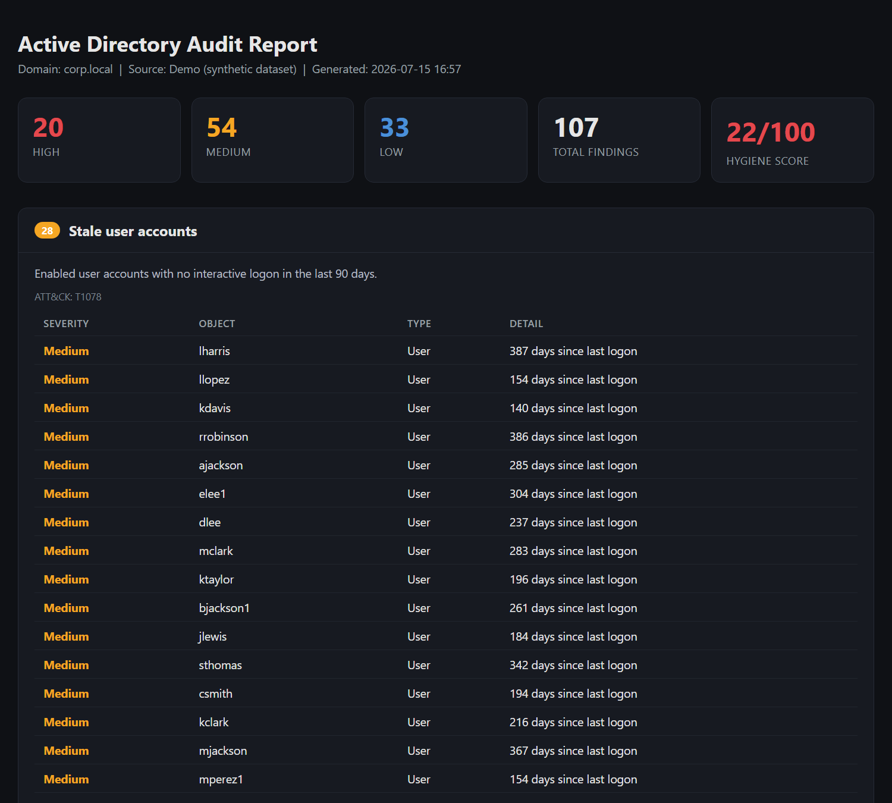
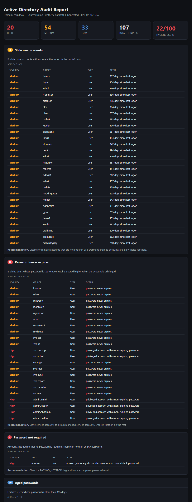
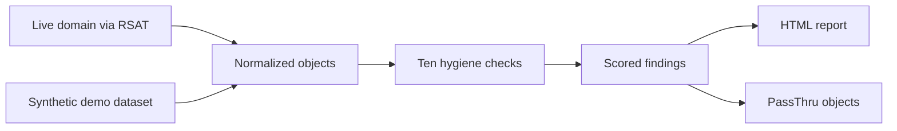

# AD-Audit-Toolkit

Read-only Active Directory hygiene auditor. Ten identity security checks, one scored HTML report.




## The problem

Active Directory drifts. Accounts go stale, service accounts collect non-expiring passwords, and privileged groups grow one temporary member at a time. Most environments have no scheduled way to see that drift. An attacker who lands inside enumerates these exact weaknesses in minutes. A defender should see them first.

This tool runs the checks an attacker would run, and reports them as a defender needs them.

## What it does

- Audits stale accounts, non-expiring passwords, blank-password flags, and aged passwords.
- Finds privileged group sprawl and privileged accounts that are inactive or disabled.
- Flags kerberoastable accounts, unconstrained delegation, and dormant computer objects.
- Checks the domain password policy against a defensible baseline.
- Scores overall hygiene and writes a self-contained HTML report you can hand to a manager.
- Maps every check to the MITRE ATT&CK technique it defends against.
- Reads only. Nothing in this module writes to Active Directory.

## Screenshots

The report opens with a severity summary and a hygiene score. Each check explains itself, lists the objects it flagged, and gives a recommendation.



## Architecture



Both data sources normalize into one internal shape. Every check runs identically against a real domain or the demo dataset. That is why demo mode is a true test of the logic and not a mock.

## Quick start

Demo mode needs no domain and no RSAT. It runs anywhere in seconds.

```powershell
Import-Module .\ADAuditToolkit\ADAuditToolkit.psd1
Invoke-ADAudit -Demo
```

That writes a timestamped HTML report to the current directory and prints a summary. Open the report in any browser.

Against a real domain, from a machine with the RSAT ActiveDirectory module:

```powershell
Invoke-ADAudit -OutputPath C:\Reports\ad-hygiene.html
```

Target a specific domain controller with `-Server dc01.example.com`. Capture the structured results with `-PassThru`.

## Usage examples

Run the audit and work with the findings in the pipeline.

```powershell
$audit = Invoke-ADAudit -Demo -PassThru
$audit.Summary.Score
$audit.Checks | Where-Object CheckId -eq 'KERBEROASTABLE' | Select-Object -Expand Findings
```

## How it works

Each check answers one question an attacker asks about a domain.

- **Stale and dormant objects.** Enabled accounts that no one uses are quiet footholds. The checks find enabled users with no logon in 90 days and enabled computers silent for 120 days.
- **Password weaknesses.** Non-expiring passwords, the PASSWD_NOTREQD flag, and aged passwords all reduce the cost of guessing or reusing a credential. A non-expiring password on a privileged account is scored higher.
- **Privileged sprawl.** The tool resolves privileged group membership recursively, including nested groups, and compares the effective count against a conservative baseline. It also finds privileged members who are disabled or inactive, because those are the accounts nobody is watching.
- **Kerberoasting exposure.** Any user account with a service principal name can have its service ticket requested by any domain user and cracked offline. The check finds those accounts and scores privileged ones higher.
- **Unconstrained delegation.** An object other than a domain controller trusted for unconstrained delegation can capture the tickets of anyone who authenticates to it. The check finds them and excludes domain controllers, which hold this by design.
- **Password policy.** The default domain policy is measured against a baseline of a 14 character minimum, complexity and lockout enabled, and reversible encryption off.

The hygiene score is a maturity view across the ten categories, not a raw count. Each category is worth ten points and loses points based on the severity of its worst finding. One noisy check does not sink the whole score, and a single High finding in a category is treated as seriously as many.

## MITRE ATT&CK mapping

| Check | Technique |
|-------|-----------|
| Stale user accounts | T1078 Valid Accounts |
| Password never expires | T1078, T1110 Brute Force |
| Password not required | T1078, T1110 |
| Aged passwords | T1110 |
| Privileged group sprawl | T1078 |
| Inactive privileged accounts | T1078, T1098 Account Manipulation |
| Kerberoastable accounts | T1558.003 Kerberoasting |
| Unconstrained delegation | T1550 Use Alternate Authentication Material |
| Dormant computer objects | T1078 |
| Weak password policy | T1110 |

## Demo data

The demo dataset is generated by `tools/New-DemoDataset.ps1`. Every object in it is fake. Dates are stored as day offsets so the demo stays stable no matter when you run it. The dataset seeds a realistic mix of clean accounts and deliberate findings so a reviewer sees every check do its job.

## Roadmap

- Export findings to CSV and JSON for pipeline use.
- Fine-grained password policy support for shops that use PSOs.
- A comparison mode that diffs two audits and reports what drifted.
- Optional scheduled run with email delivery.

## What I learned

I built the live collector and the demo loader to return the exact same object shape. That one decision made the rest of the tool simple. Every check is a pure function over normalized data. Testing became easy because I could feed the checks a small handmade dataset and assert on the findings, with no domain required.

I also learned to be careful with the hygiene score. My first version subtracted a fixed penalty per finding. A messy domain floored it at zero, which told the reader nothing. A per-category maturity score is more honest and more useful.

## Notes on this portfolio

Projects in this portfolio are built through my automated development pipeline. I design them, review the output, and operate the system that ships them. The pipeline itself is the final project in the set.

## License

MIT. See [LICENSE](LICENSE).
